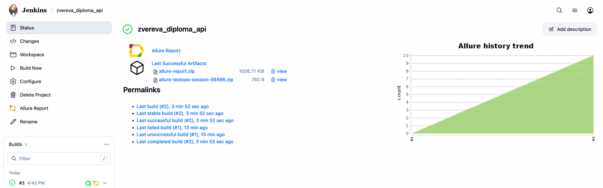
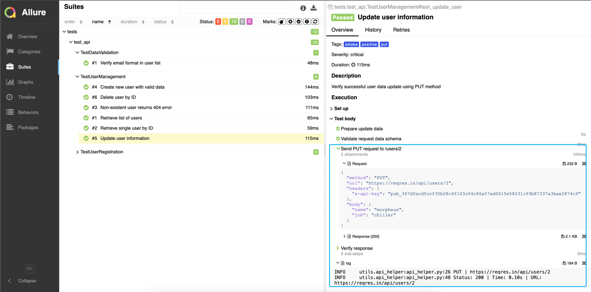
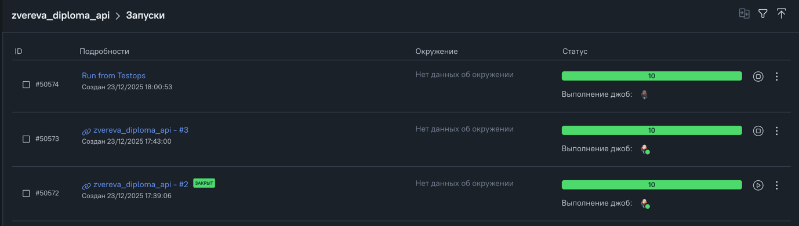
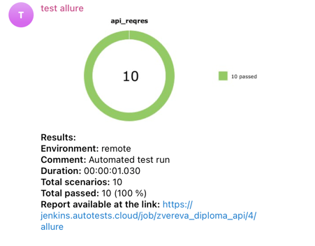

# ReqRes API Test Automation Project

Comprehensive API test automation suite for ReqRes.in REST API covering user registration, CRUD operations, and data validation.

## 📊 Test Coverage

### User Registration Tests (3 tests)

Successful Registration - Valid email and password registration flow
Missing Password Validation - Verify 400 error when password is not provided
Missing Email Validation - Verify 400 error when email is not provided

### User Management Tests (6 tests)

Get User List - Retrieve paginated list of users
Get Single User - Fetch specific user by ID
Get Non-existent User - Verify 404 error for invalid user ID
Create User - Create new user with generated data
Update User - Update existing user information via PUT request
Delete User - Delete user and verify 204 response

### Data Validation Tests (1 test)

Email Format Validation - Verify all user emails contain @ and end with @reqres.in domain

Total: 10 API tests

## 🚀 Tech Stack

- **Python 3.11+** - Programming language
- **Pytest** - Testing framework
- **Requests** - API testing
- **Allure** - Test reporting
- **JSONSchema** - Request/Response schema validation
- **Faker** - Test data generation
- **Python-dotenv** - Environment variables management
- **Poetry** - Dependency management

## ⚙️ Setup & Configuration

### 1. Install Dependencies
```bash
poetry install
```
### 2. ReqRes API Key
To obtain ReqRes API key:
1. Go to [ReqRes Sign Up](https://reqres.in/)
2. Create a free account
3. After registration, navigate to your project dashboard
4. Copy your Public (Admin) API Key from the API Keys section

### 3. Environment Variables
Create .env file in project root:
```bash
REQRES_PUBLIC_KEY=your_public_api_key_here
```

## 🧪 Test Execution

### Run all tests
```bash
pytest tests -v
```

### Run Tests by Tags
```bash
pytest tests_api.py -v -m smoke

pytest tests_api.py -v -m regression

pytest tests_api.py -v -k positive
```
### Generate Allure Report
```bash
# Run tests with Allure
pytest tests -v --alluredir=allure-results

# View report
allure serve allure-results
```
---

## 🔗 CI/CD Integration
*[Jenkins Job](https://jenkins.autotests.cloud/job/zvereva_diploma_api/) is created*


### Allure Reports in Jenkins

Jenkins test runs generate an Allure report.  

### 📝 Test Features
#### Comprehensive Logging

- Console logging with timestamp, log level, and test execution details
- Allure attachments for every API request and response
- Request details: Method, URL, Headers, Body
- Response details: Status code, Headers, Body, Response time

#### Schema Validation

- Request schema validation for POST and PUT operations
- Response schema validation for all endpoints
- Uses JSONSchema library for strict data structure validation


TestOps run is configured:


Telegram notification is sent after the test run completion:


